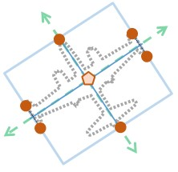
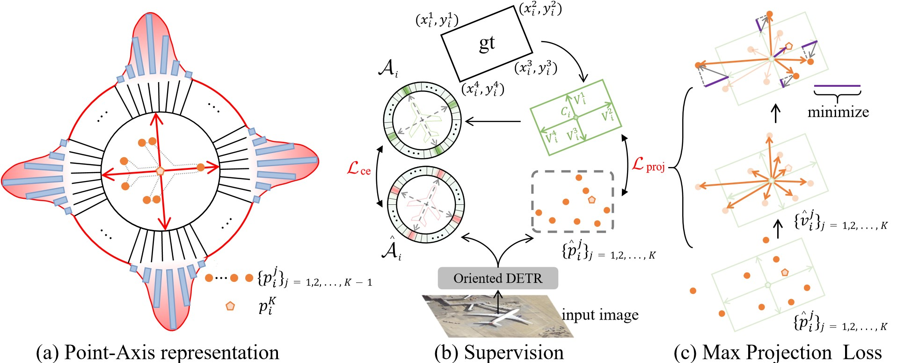

# Point-Axis Representation  on DETR Framework 

[](https://paperswithcode.com/sota/object-detection-in-aerial-images-on-dota-1?p=projecting-points-to-axes-oriented-object)

By [Zeyang Zhao](https://scholar.google.com.hk/citations?user=jlDQUOkAAAAJ&hl=zh-CN),  [Qilong Xue](https://github.com/QilongXue),  [Yuhang He](https://scholar.google.com.hk/citations?user=9VCIiVcAAAAJ&hl=zh-CN), [Yifan Bai](https://github.com/AlexDotHam), [Weixing](https://scholar.google.com.hk/citations?user=KNyC5EUAAAAJ&hl=zh-CN), [Yihong Gong](https://scholar.google.com.hk/citations?user=x2xdU7gAAAAJ&hl=zh-CN).

This repository is an official implementation of the paper [Projecting Points to Axes: Oriented Object Detection via Point-Axis Representation](https://arxiv.org/pdf/2407.08489).

# News
[2024/7/10]: The paper has been accepted by **ECCV 2024 (Oral)** !</br>


# Introduction

The contributions of this paper are twofold: 
1. **Point-Axis Representation**, which addresses the challenges of representation and supervision in Oriented Object Detection.
2. **Oriented-DETR**, the implementation of Point-Axis Representation on the DETR framework.

For more details, please refer to our paper.
# Methods



## Data Preparation

<details>
  <summary>DOTA</summary>
1. Download the DOTA dataset from the official website, and you will receive data organized in the following format:

```
DOTAV1_0/
  ├── train/
    ├── labelTxt
    ├── images
  ├── val/
    ├── labelTxt
    ├── images
  ├── test2017/
    ├── images  
```

2. Use **DOTA_devkit/ImgSplit_multi_process.py** to achieve the following data organization, take **Single Scale** splitting as an example:

```
DOTAV1_0_SS_SPLIT/
  ├── train_split_rate1.0_subsize1024_gap200/
    ├── labelTxt
    ├── images
  ├── val_split_rate1.0_subsize1024_gap200/
    ├── labelTxt
    ├── images
  ├── test_split_rate1.0_subsize1024_gap200/
    ├── images  
```

3. Re-organize the dataset into COCO format, 
**instances_trainval2017.json** is generated by **DOTA_devkit/DOTA2COCO.py**, **instances_test2017.json** is generated by **DOTA_devkit/test2coco.py**:

```
DOTAV1_0_SS_SPLIT_COCO/
  ├── trainval2017/
  ├── test2017/
  └── annotations/
  	├── instances_trainval2017.json
  	└── instances_test2017.json
```
4. The operation for **Multi Scale** spliting is similar, or you can also follow the official instructions provided by the DOTA dataset:

```
DOTAV1_0_MS_SPLIT_COCO/
  ├── trainval2017/
  ├── test2017/
  └── annotations/
  	├── instances_trainval2017.json
  	└── instances_test2017.json
```

</details>

<details>
  <summary>DIOR</summary>

Please download and organize the DIOR dataset as follows:
```
DIOR/
  ├── trainval2017/
  ├── test2017/
  └── annotations/
  	├── instances_trainval2017.json
  	└── instances_test2017.json
```
We also provide a [Google Drive](https://drive.google.com/drive/folders/1-3NwTuFEdV_OOejos5BSYcoo_rFEhPgj?usp=drive_link) link for the pre-organized **DIOR** dataset
</details>


## Model Zoo

### Trained on COCO
Oriented-DETR can be easily adapted for horizontal object detection, as detailed in **Chapter 4.5**.
The pretrained model can be download from the [Google Drive](https://drive.google.com/drive/folders/1-3NwTuFEdV_OOejos5BSYcoo_rFEhPgj?usp=drive_link).
### Trained on DOTA
<table>
  <thead>
    <tr style="text-align: right;">
      <th></th>
      <th>backbone</th>
      <th>SS/MS</th>
      <th>map50</th>
      <th>map75</th>
      <th>Checkpoint</th>
    </tr>
  </thead>
  <tbody>
    <tr>
      <th>1</th>
      <td>R50</td>
      <td>SS</td>
      <td>79.1</td>
      <td>53.0</td>
      <td><a href="https://drive.google.com/drive/folders/1-3NwTuFEdV_OOejos5BSYcoo_rFEhPgj?usp=drive_link">Google Drive</a></td>
    </tr>
    <tr>
      <th>2</th>
      <td>Swin-T</td>
      <td>SS</td>
      <td>79.8</td>
      <td>55.6</td>
      <td><a href="https://drive.google.com/drive/folders/1-3NwTuFEdV_OOejos5BSYcoo_rFEhPgj?usp=drive_link">Google Drive</a></td>
    </tr>
    <tr>
      <th>3</th>
      <td>Swin-T</td>
      <td>MS</td>
      <td>81.8</td>
      <td>59.1</td>
      <td><a href="https://drive.google.com/drive/folders/1-3NwTuFEdV_OOejos5BSYcoo_rFEhPgj?usp=drive_link">Google Drive</a></td>
    </tr>
    <tr>
      <th>4</th>
      <td>Swin-L</td>
      <td>MS</td>
      <td>82.3</td>
      <td>59.6</td>
      <td><a href="https://drive.google.com/drive/folders/1-3NwTuFEdV_OOejos5BSYcoo_rFEhPgj?usp=drive_link">Google Drive</a></td>
    </tr>
  </tbody>
</table>

### Trained on DIOR
<table>
  <thead>
    <tr style="text-align: right;">
      <th></th>
      <th>backbone</th>
      <th>SS/MS</th>
      <th>map50</th>
      <th>map75</th>
      <th>Checkpoint</th>
    </tr>
  </thead>
  <tbody>
    <tr>
      <th>1</th>
      <td>R50</td>
      <td>SS</td>
      <td>69.7</td>
      <td>49.3</td>
      <td><a href="https://drive.google.com/drive/folders/1-3NwTuFEdV_OOejos5BSYcoo_rFEhPgj?usp=drive_link">Google Drive</a></td>
    </tr>
    <tr>
      <th>2</th>
      <td>Swin-T</td>
      <td>SS</td>
      <td>74.3</td>
      <td>53.1</td>
      <td><a href="https://drive.google.com/drive/folders/1-3NwTuFEdV_OOejos5BSYcoo_rFEhPgj?usp=drive_link">Google Drive</a></td>
    </tr>
  </tbody>
</table>

## Installation

<details>
  

1. Install pytorch and torchvision

   Follow the instruction on https://pytorch.org/get-started/locally/.
   ```sh
   # an example:
   pip install torch==1.12.0+cu113 torchvision==0.13.0+cu113 torchaudio==0.12.0 --extra-index-url https://download.pytorch.org/whl/cu113
   ```

   Note:The version of CUDA corresponding to PyTorch should ideally match the version of CUDA installed on your system.
   
2. Install other needed packages
   ```sh
   pip install -r requirements.txt
   ```

3. Compiling CUDA operators
   ```sh
   cd models/odetr/ops
   python setup.py build install
   # unit test (should see all checking is True)
   python test.py
   cd ../../..
   ```
4. Install DOTA_devkit (Optional, for preparing datasets)
   ````sh
   cd DOTA_devkit
   sudo apt-get install swig
   swig -c++ -python polyiou.i
   python setup.py build_ext --inplace
   ````
</details>


## Run

<details>
  <summary>1. Train</summary>
Please download the COCO pre-trained weights and use the following command to complete the training:

```sh
# distributed training
python -m torch.distributed.run --nproc_per_node=\$gpu_num\$ main.py --local_rank=0  
--output_dir \$your_output_dir\$ -c \$your_config\$ --coco_path \$coco_dir\$  
--dataset_file dota --pretrain_model_path $model_pretrained_on_coco$
# -r50 with single-scale spliting on dota an example, map50:79.1
python -m torch.distributed.run --nproc_per_node=8 main.py --local_rank=0  
--output_dir logs/r50_dota_ss -c config/dota/4scale_res50_dior.py 
--coco_path Your_Path/DOTAV1_0_SS_SPLIT_COCO  
--dataset_file dota --pretrain_model_path r50_coco_pre.pth
```

</details>


<details>
  <summary>2. Offline Eval</summary>

  <!-- ### Eval our pretrianed model -->

  Since the DIOR test set provides ground truth labels, we can perform offline eval.

```sh

# an example on swin-t

python main.py --local_rank=0 --output_dir logs/infernece_swint_dior -c config/dota/4scale_swint_dior.py 
--coco_path Your_Path/DIOR_COCO --dataset_file dota --pretrain_model_path Your_Path/swin_t_dior.pth --eval

```
</details>


<details>
  <summary>3. Online Test on DOTA</summary>
The DOTA dataset does not provide test results, so we need to first generate inference results and then upload them to the official platform for verification.

1. Inference

```sh
# an example on swin-t on single scale spliting dota
python main.py --local_rank=0 --output_dir logs/infernece_swint_ss -c config/dota/4scale_swint_dior.py 
--coco_path Your_Path/DOTAV1_0_SS_SPLIT_COCO --dataset_file dota --pretrain_model_path Your_Path/swin_t_dota_ss.pth --test

# an example on swin-t on multi scale spliting dota
python main.py --local_rank=0 --output_dir logs/inference_swint_ms -c config/dota/4scale_swint_ms_dota.py 
--coco_path Your_Path/DOTAV1_0_MS_SPLIT_COCO --dataset_file dota --pretrain_model_path Your_Path/model.pth --test

```
then get a **_result_raw_** file in the output_dir.

**Note**: If you want to obtain precise COCO metrics, please lower the inf_conf in the config file (e.g., 0.005). If you want to get a visualization result closer to the real state, 
please increase the inf_conf (e.g., 0.15).

2. Merge the results

```sh
# check your path and run:
python DOTA_devkit/ResultMerge.py
```

3. Compress the results into **_result_merge.zip_** and upload it to the [official website](https://captain-whu.github.io/DOTA/evaluation.html).


</details>


# Acknowledgement
Our idea is implemented base on [DINO](https://github.com/IDEA-Research/DINO), [yolov5-obb](https://github.com/hukaixuan19970627/yolov5_obb)  and [DOTA_devkit](https://github.com/CAPTAIN-WHU/DOTA_devkit) . We really appreciate their excellent open-source works!

**Note:** This project is not for commercial use. For commercial use, please contact the author.

**Note:** This project is not for commercial use. For commercial use, please contact the author.

**Note:** This project is not for commercial use. For commercial use, please contact the author.

# Citation
If you find our work helpful for your research, please consider citing the following BibTeX entry.   
```bibtex
@inproceedings{zhao2025projecting,
  title={Projecting points to axes: Oriented object detection via point-axis representation},
  author={Zhao, Zeyang and Xue, Qilong and He, Yuhang and Bai, Yifan and Wei, Xing and Gong, Yihong},
  booktitle={European Conference on Computer Vision},
  pages={161--179},
  year={2025},
  organization={Springer}
}

```